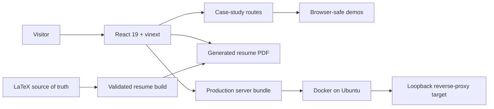

<div align="center">

# Eesher Janda — Engineering Portfolio

**Interactive case studies for distributed systems, developer infrastructure, and reliable software.**

[](https://eesherj.com)
[](https://eesherj.com/Eesher_Janda_Resume.pdf)
[](https://www.typescriptlang.org/)
[](Dockerfile)

</div>

This repository powers [eesherj.com](https://eesherj.com), a portfolio built around engineering evidence rather than a static project gallery. Each featured system includes the problem, architecture, design trade-offs, reproducible verification, and an interactive browser-safe demonstration.

## Featured case studies

| Project | Engineering focus | Interactive evidence |
|---|---|---|
| [TriageCI](https://eesherj.com/projects/triageci) | signed CI ingestion, idempotency, backpressure, flaky-test classification | step through the analyzer's state transitions |
| [RaftKV](https://eesherj.com/projects/raftkv) | consensus, crash recovery, snapshots, quorum-checked reads | inspect an annotated failover sequence |
| [SyncLab](https://eesherj.com/projects/synclab) | CRDT convergence, offline replay, encryption, ordered WebSockets | reorder and duplicate operations, then verify convergence |

The embedded demonstrations are intentionally scoped: they reuse or model the relevant algorithms without pretending to run the projects' full distributed backends in the visitor's browser. Their boundaries and pinned source revisions are documented in [`docs/PORTFOLIO.md`](docs/PORTFOLIO.md).

## Architecture



## Engineering highlights

- Three server-rendered project case studies with working interactive models.
- Source-pinned project evidence, measurement context, and explicit demonstration boundaries.
- A single-source LaTeX résumé pipeline with one-page, text-extraction, PDF-size, link, and overflow checks.
- Docker multi-stage builds that generate the résumé instead of committing a stale PDF.
- A guarded Ubuntu deployment workflow with health checks, fast-forward-only updates, and rollback behavior.
- Unit coverage for demo logic, navigation invariants, résumé validation, and deployment safety rules.

## Run locally

Requirements: Node.js 22.13+, pnpm 11, a supported LaTeX compiler, and Poppler utilities for résumé validation.

```bash
git clone https://github.com/EesherJ39/portfolio.git
cd portfolio
pnpm install --frozen-lockfile
pnpm dev
```

Open the local URL shown by the development server. `pnpm dev` rebuilds the résumé before starting the site.

## Verify

```bash
pnpm resume:build
pnpm exec tsc --noEmit
pnpm lint
node --experimental-strip-types --test tests/*.test.mjs
pnpm build
```

The résumé master is [`resume/Eesher_Janda_Resume.tex`](resume/Eesher_Janda_Resume.tex). Generated copies in `public/` are build artifacts; the live site and external profiles use one canonical PDF URL.

## Repository map

| Path | Responsibility |
|---|---|
| `app/` | homepage, project routes, interactive case-study UI |
| `lib/projects.ts` | structured project narrative and pinned evidence links |
| `lib/demos/` | browser-safe TriageCI, RaftKV, and SyncLab models |
| `resume/` | canonical LaTeX source and résumé workflow |
| `scripts/` | résumé build and structural PDF validation |
| `tests/` | portfolio and résumé regression tests |
| `deploy/` | guarded Ubuntu polling deployment and its test suite |
| `docs/PORTFOLIO.md` | evidence, authorship, and demo boundaries |

## Deployment

Production runs from a multi-stage Docker image and publishes only to `127.0.0.1:23601`, leaving public TLS and routing to the host's reverse proxy. See [`deploy/README.md`](deploy/README.md) for the reviewed server workflow, operational checks, and rollback limitations.

## Content and measurement policy

Employer source code and confidential screenshots are not included. Historical project measurements are labeled with their workload and environment; the website does not silently rerun or generalize them. Interactive demos make their reduced scope visible so visitors can distinguish executable evidence from illustration.
